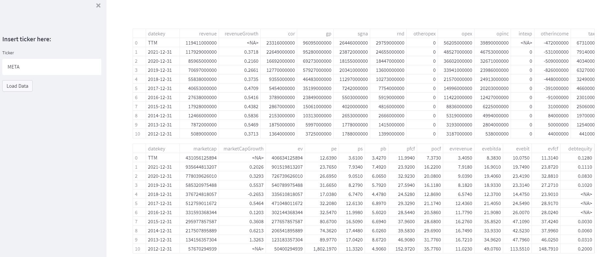
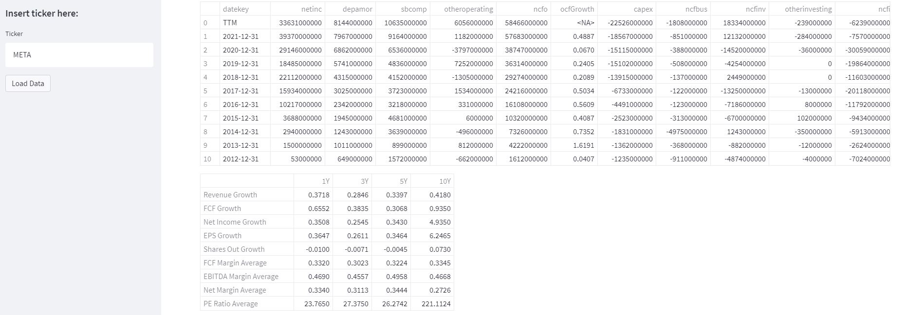
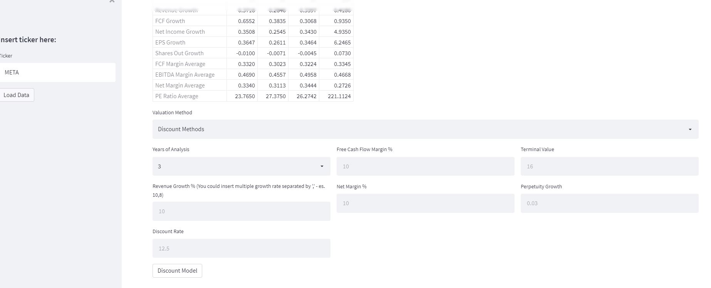
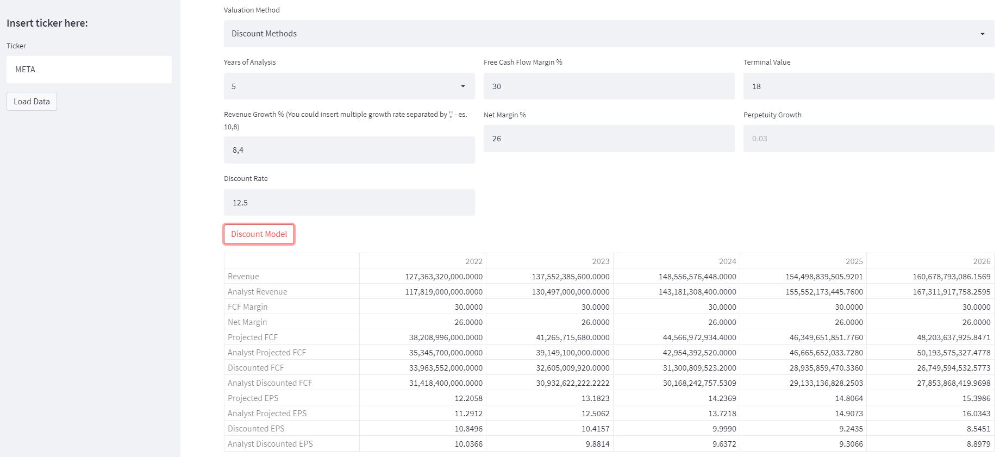
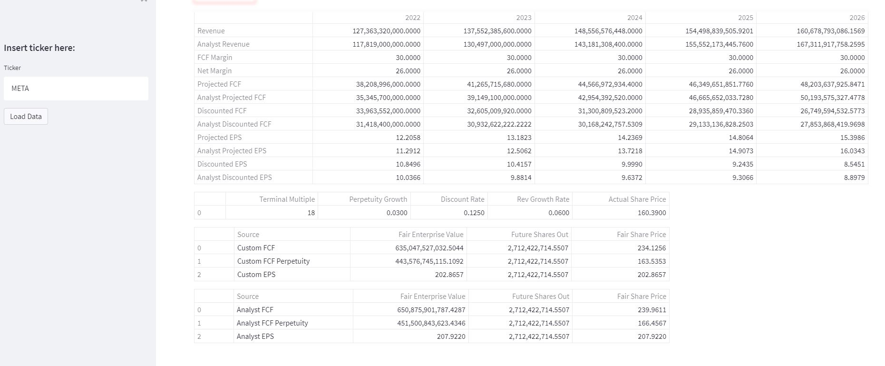

# stock-market-fundamental-analysis
This tool helps in the fundamental analysis of the stock market through a simple and intuitive interface with which it is possible to visualize the balance sheet and the financial situation of a chosen stock through its ticker.   Also available are the Discount Cash Flow and EV/EBITDA (not implemented yet) methods for calculating the intrinsic value of a stock.

## Setup

Use the package manager [pip](https://pip.pypa.io/en/stable/) to install the dependencies from the requirements.txt.

```bash
pip install -r requirements.txt
```
## Usage

In the source folder

```bash
streamlit run streamlit_main.py
```

## Example

### ticker symbol in the text box on the left and click on "Load Data"




### Then insert your desired parameters to calculate discounted cash flow






## Contributing
Pull requests are welcome. For major changes, please open an issue first to discuss what you would like to change.


## License
[MIT](https://choosealicense.com/licenses/mit/)
